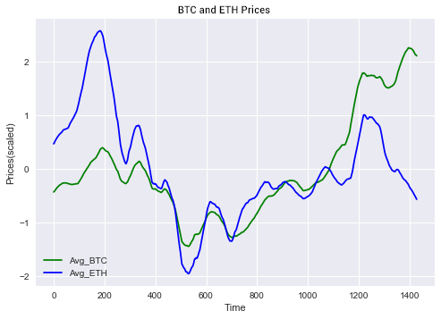
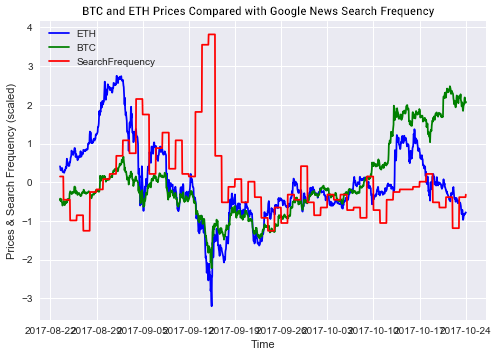
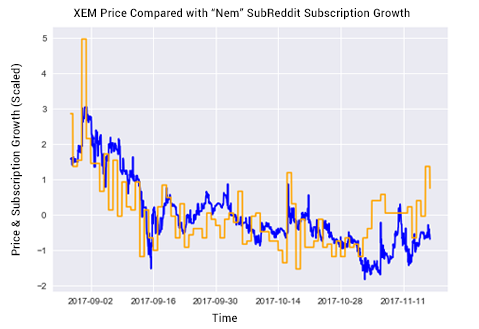

# Фактори врз вредноста

- **Bitcoin**. Технологијата која стои позади криптовалутите е за прв пат имплементирана кај Bitcoin-от. Како што Bitcoin добива или губи на вредност, така и активностите околу помалите валути(altcoin-ите) се под истото влијание. Доколку расте, растат и останатите кои се настанати под негово влијание. Доколку паѓа, во падот го следат и останатите. На графикот е претставено споредбено и скалирано промените во вредноста на Bitcoin-от(со зелено), наспроти таа на Ethereum-от(со сино), на ист временски интервал:

- **Тековни настани**. Сосема сфатливо е дека некој тековен настан апсолутно влијае врз вредноста на криптовалутите. Доколку се појави некој правен случај против одредена валута, нормално е вредноста на истата да паѓа. Доколку Elon Musk излезе на твитер и излезе дека ќе дозволи во неговата компанија да се плаќа со виртуелна валута, нормално е вредноста на истата да се зголемува. Сосема често користен трик на модерните "инфлуенсери" во денешно време се споменатите форми на "pump and dump"-ови. Таа шема се состои од вештачко наведување кон раст или пад на вредноста преку креирање позитивна или негативна слика со цел носење на спомената вредност во насока на која што на нив им одговара. Шема што теоретски е нелегална, но со сè поголемите можности да се изведе е сè потешко да се докаже како таква. На графикот е прикажано движењето на вредноста на двете валути(со сино и зелено), во случајов пад, наспроти зголемувањето на Google пребарувањата на тема криптовалути(со црвено):

Во конкретниот извадок од временската серија на податоци евидентна е поврзаноста помеѓу секој пад и зголемувањето на интересот за пребарување на таа тема(негативни вести или настани случени кои донесуваат до акции како "панично продавање").

- **Перцепцијата во јавноста**. Навидум сличен фактор како претходниот, но сепак со доста разлики. Колку поголем е бројот на луѓе кои делува како да се разбираат од истите, толку е и поголема шансата некој друг да се убеди во вмешување во тргување со истите. Така и обратното, доколку е мала групата, односно заедницата, која е вмешана во истото, толку помала ќе е и довербата која што ќе ја имаат луѓето однадвор за самиот продукт кој го претставува заедницата. На графикот е прикажана скалирано промената во бројност на популарен subreddit на тема криптовалути и корелацијата која ја има со самата вредност на истите:

