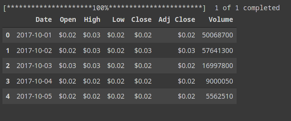

# Градење на модел

Предвидувањето на вредноста на валутите е тешко, посебно со оглед на тоа колку тој пазар е сè уште склон на нагли промени, а и фактот дека е во порана фаза од својот развој и има уште делови од својот екосистем кои треба да ги додефинира пред да би се прифатил во некоја поопширна употреба. На некој начин е како интернетот во 80тите години. Тогаш се појавил како платформа со отворена технологија која ги збунувала луѓето и користа која тие би ја имале од истата, сè додека не се појавиле фирмите како Amazon, Google и Facebook со јасна идеја за иновации во склоп на таа платформа. Клучниот збор е "Permisionless inovation", што значи дека секој може да внесе некоја иновација без да бара дозвола од некој друг. Па, баш поради сè ова и не може толку лесно да земе било кој да предвиди како ќе се движи самиот пазар на валутите, а со тоа и сонот на сите, лесно да заработи од истото. 

За градење на моделот ќе користиме библиотека наречена [Prophet](https://facebook.github.io/prophet/), развивана од Facebook, која е популарна конкретно за модели за предвидување на временски податоци. Базирана е со [Additive model](https://en.wikipedia.org/wiki/Additive_model) на регресија и се користи за креирање на точни и разумни предвидувања. 

# Вчитување на библиотеки

Како и секогаш, ќе почнеме со вчитување на библиотеките кои ќе ни бидат потребни за градење на моделот:

```python
from datetime import datetime, timedelta
from fbprophet import Prophet
from fbprophet.plot import plot_components_plotly, plot_plotly

import pandas as pd
import plotly.graph_objects as go
import warnings
import yfinance as yf

warnings.filterwarnings('ignore')
pd.options.display.float_format = '${:,.2f}'.format
```

# Преземање на податоци

За преземање на податоците ќе ја користиме yfinance библиотеката, со чива помош се пристапува до податоците на Yahoo! Finance. За пример валута ја земавме [Cardano](https://cardano.org/), софтвер кој употребува доста нова технологија и иновации и податоците за вредноста на истиот како валута се од 01 октомври 2017 година:

```python
today = datetime.today().strftime('%Y-%m-%d')
start_date = '2017-10-01'

ada_df = yf.download('ADA-USD',start_date, today)
ada_df.reset_index(inplace=True)
```

```python
ada_df.head()
```



```python
ada_df.tail()
```


Лесно забележлива е промената на вредноста во периодот од една година кој е изминат.

# Проверка на податоци

```python
ada_df.info()
```


```python
ada_df.isnull().sum()
```


Поради изворот од кој ги преземавме и типот на податоци кои ги нуди, забележавме дека податоците се доста "чисти" и нема потреба да се извршуваат некакви операции врз нив како би се користеле, што би ја смениле нивната вредност.

# Креирање на модел

Две колони се потребни како влез во моделот, датумот и бројката која ќе ја земеме како вредност за тој ден(се одлучивме за вредноста од колоната Open). 

```python
df = ada_df[["Date", "Open"]]

new_names = {
    "Date": "ds", 
    "Open": "y",
}

df.rename(columns=new_names, inplace=True)

df.tail()
```


За подобра визуелна репрезентација, вчитаните податоци ги прикажуваме со помош на библиотеката Plotly:

```python
x = df["ds"]
y = df["y"]

fig = go.Figure()

fig.add_trace(go.Scatter(x=x, y=y))

fig.update_layout(
    title_text="Time series plot of Cardano ($ADA) Open Price",
)

fig.update_layout(
    xaxis=dict(
        rangeselector=dict(
            buttons=list(
                [
                    dict(count=1, label="1m", step="month", stepmode="backward"),
                    dict(count=6, label="6m", step="month", stepmode="backward"),
                    dict(count=1, label="YTD", step="year", stepmode="todate"),
                    dict(count=1, label="1y", step="year", stepmode="backward"),
                    dict(step="all"),
                ]
            )
        ),
        rangeslider=dict(visible=True),
        type="date",
    )
)
```


Креирање на моделот, предавање на влезните податоци, како и задавање на колку денови од иднината сакаме да се додадат во моделот како предвидена вредност:

```python
m = Prophet(
    seasonality_mode="multiplicative" 
)

m.fit(df)

future = m.make_future_dataframe(periods = 365) 
```

Приказ на последните денови кои ќе бидат предвидени:

```python
future.tail()
```


# Предвидување на резултати

Приказ на две предвидувања на резултати:

- следниот ден(утре) од денес:

```python
next_day = (datetime.today() + timedelta(days=1)).strftime('%Y-%m-%d')

forecast[forecast['ds'] == next_day]['yhat'].item()
```

> 1.8646246112439222

- сите зададени вредности во денови при креирање на модел:

```python
forecast = m.predict(future)

forecast[['ds', 'yhat', 'yhat_lower', 'yhat_upper']].tail()
```


Забележуваме дека моделот предвидува зголемување на вредноста за речиси двојно во периодот за една година од денес.

# Исцртување на резултати

Приказ на иманите резултати досега, заедно со додадените предвидувања за периодот од една година од денес:

```python
plot_plotly(m, forecast)
```

<a href="./forecast.html">Приказ на излезот</a>

# Компоненти на предвидување

Моделот на предвидување вклучува неколку компоненти кои во продолжение ги визуелизираме:

```python
plot_components_plotly(m, forecast)
```

<a href="./patterns.html">Приказ на компонентите</a>

<html> 
  <head> 
    <script src="jquery.js"></script> 
    <script> 
    $(function(){
      $("#includedContent").load("patterns.html"); 
    });
    </script> 
  </head> 

  <body> 
     <div id="includedContent"></div>
  </body> 
</html>

Компонентите кои ги опфаќа предвидувањето вклучуваат:

- анализа на растот на кривата - моделот покажува дека вредноста на криптовалутата Cardano во период од една година сметано од денес ќе има нагорен тренд.

- сезонска анализа на ниво на месец - моделот покажува тeнденција дека вредноста на валутата е највисока во пролетните месеци, додека најниска во есенските.

- сезонска анализа на ниво на ден - моделот покажува тенденција дека вредноста на валутата е највисока во петок, додека најниска е во вторник.